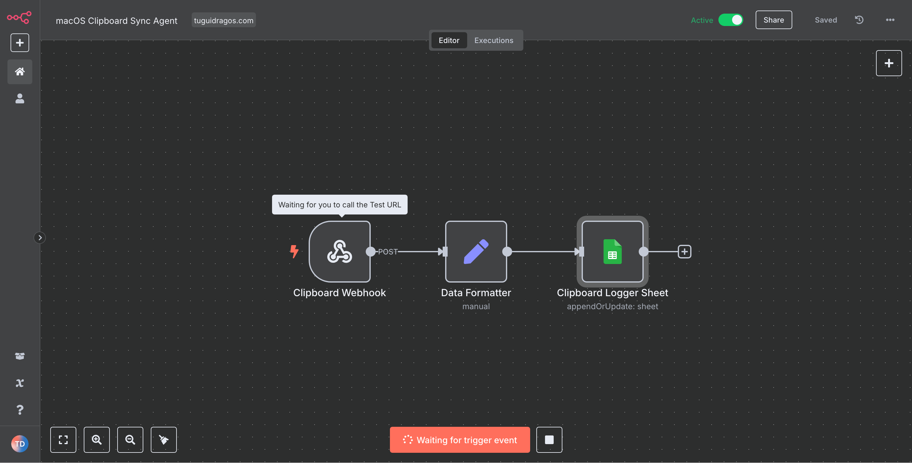
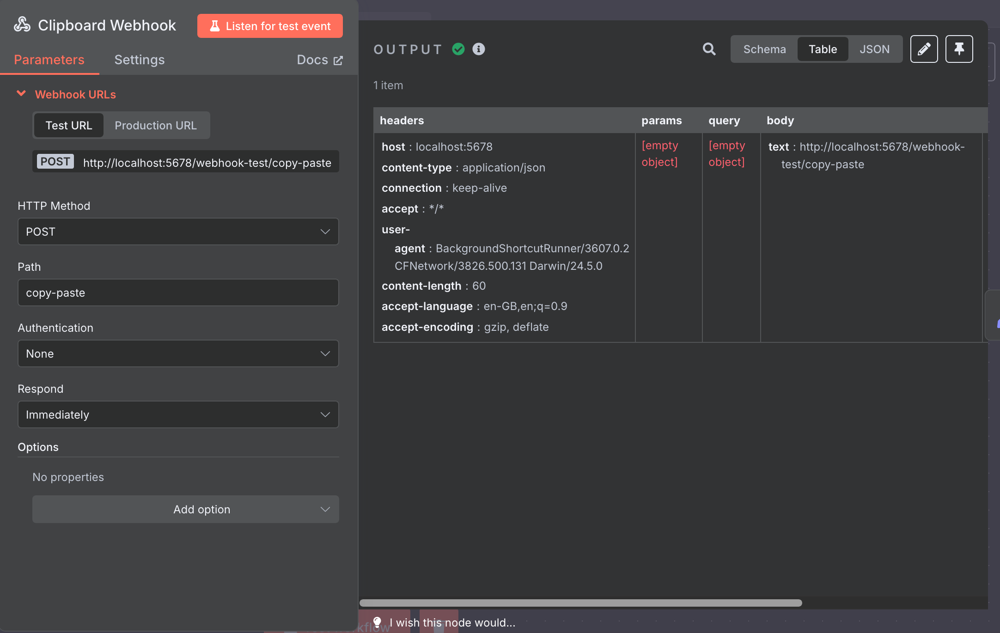
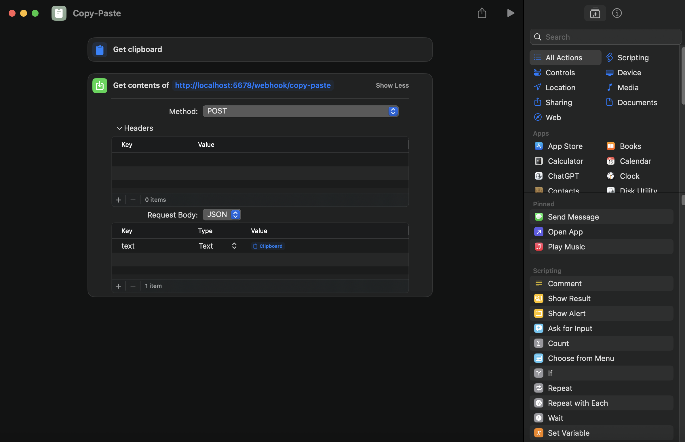
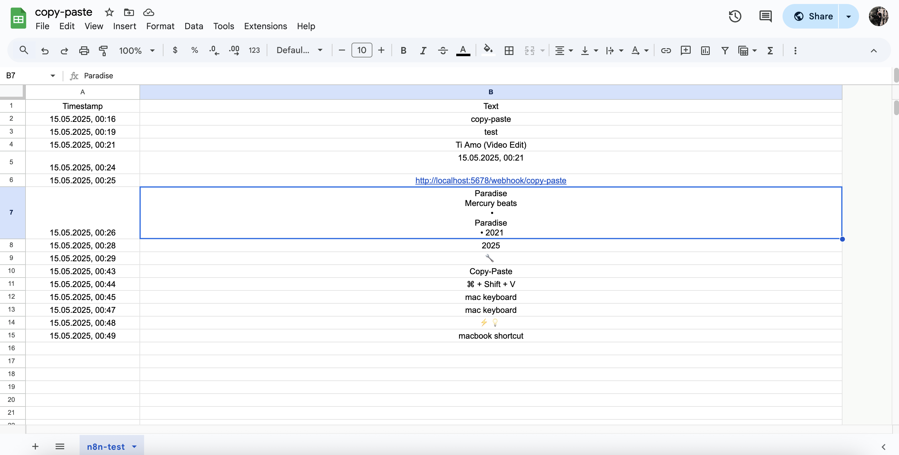

# macOS Clipboard Sync Agent 🚀

A local automation system that lets you save your clipboard content into a Google Sheet with a simple keyboard shortcut on macOS.

No cloud services. No bloat. Just n8n + Apple Shortcuts.

---

## 🧩 What you need

- n8n installed locally (or on a VPS)
- Google account with a Google Sheet
- Apple Shortcuts app (built-in on macOS)
- 3 simple nodes in n8n: `Webhook`, `Set`, and `Google Sheets`

---

## ⚙️ How it works

Every time you press your custom shortcut (like ⌘ + X), this happens:

1. macOS Shortcut fetches your clipboard content.
2. It sends the text as JSON to your local n8n webhook.
3. n8n receives it via the `Webhook` node.
4. The `Set` node formats the timestamp and prepares the data.
5. The `Google Sheets` node logs everything into your spreadsheet.

---

## 🛠️ Setup Instructions

### 1. Create a new Google Sheet

Create a new spreadsheet with two columns:
- `Timestamp`
- `Text`

Name the sheet tab something like `n8n-test`.

---

### 2. Build your n8n workflow

You'll only need 3 nodes:

#### 🔗 Webhook node
- Method: `POST`
- Path: `copy-paste`
- Authentication: `None`
- Set to **respond immediately**
- Copy the `Test URL` or `Production URL`

#### ✏️ Set (Edit Fields) node
- Add `Timestamp` = `{{ new Date().toLocaleString("de-DE") }}`
- Add `Text` = `{{ $json.body.text }}`
- (Or just use `{{ $json.body.text }}` if you skip formatting)

#### 🧾 Google Sheets node
- Mode: `Append Sheet`
- Sheet: your newly created one (`n8n-test`)
- Fields: match the headers: `Timestamp`, `Text`

---

### 3. Create the Apple Shortcut

Open the Shortcuts app and create a new one like this:

1. **Action 1:** `Get Clipboard`
2. **Action 2:** `Get contents of URL`
   - Method: `POST`
   - URL: `http://localhost:5678/webhook-test/copy-paste` (or your network IP)
   - Request Body: `JSON`
     - `Key`: `text`
     - `Type`: `Text`
     - `Value`: `Clipboard`

Save the shortcut as something like **Copy-Paste**.

---

### 4. Add a keyboard shortcut

Open:
`System Settings → Keyboard → Keyboard Shortcuts → Services`

Scroll down and find your shortcut (e.g., “Copy-Paste”), then assign a key combination like:

> `⌘ + X` (if you don’t use Cut often)  
> or  
> `⌘ + Shift + V` if you want to avoid conflict

Now you can simply:

- Press `⌘ + X` to run the clipboard agent  
- Then use `⌘ + C` or anything else right after, and continue your work  
- The clipboard will already be saved in the background!

---

## 🖼️ Screenshots

### 🧠 The n8n Workflow
A minimal 3-node flow: Webhook → Set → Google Sheets  

---

### 🔗 Webhook Configuration
Listening for incoming requests from the macOS Shortcut  

---

### 🔧 Apple Shortcut Setup
Two-step logic: fetch clipboard and send it  

---

### 📄 Google Sheet Log
All your copied content saved with timestamp  

---

## 💡 Why this is useful?

- No need for third-party clipboard apps
- Your clipboard history is searchable
- Works 100% offline
- Can be expanded with AI, text filters, categorization

---

## 🧾 License

MIT - Use it freely. If you build something cool with it, tag [@TuguiDragos](https://tuguidragos.com)

---

Made with 🖤 + ☕️ on macOS & n8n
